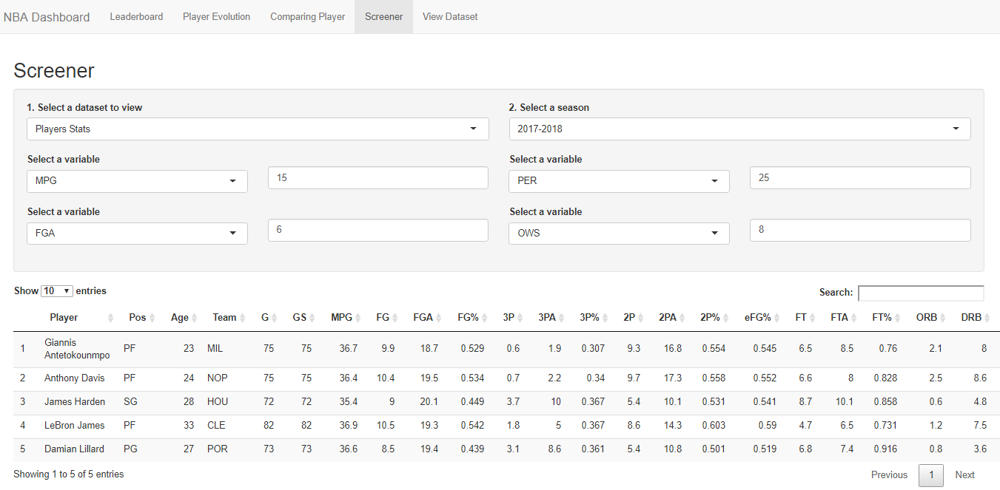
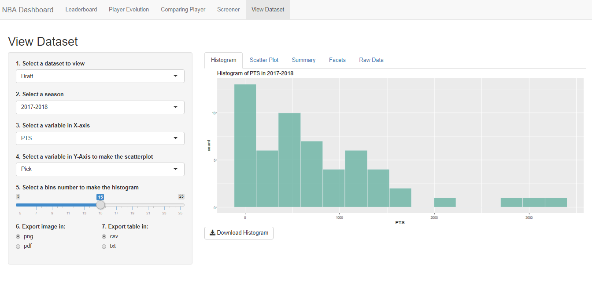

# NBA Dashboard

This dashboard shows NBA statistics tracked across the years and
can be used to visualize basic plots when going into data exploration. 

All data were scrape from https://www.basketball-reference.com/ using the rvest package.
Data Wrangling was handled with plyr and dplyr.
The dashboard was constructed using shiny and the plots were built using ggplot and plotly.

# Features

### Leaderboard

### Evolution

### Comparison

### Screener

Allows the user to choose a dataset and find an observation that matches filters inputs

### View Dataset

Allows the user to view and download a histogram, a scatterplot, a summary of the variables and the raw observations of a dataset 

